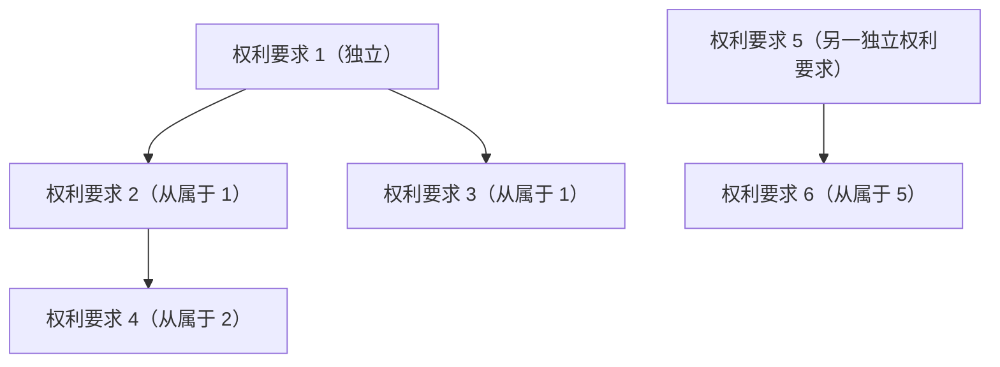
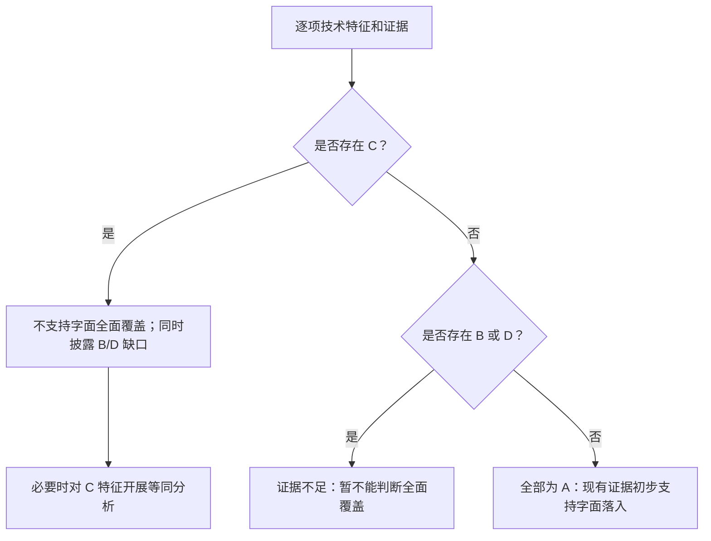
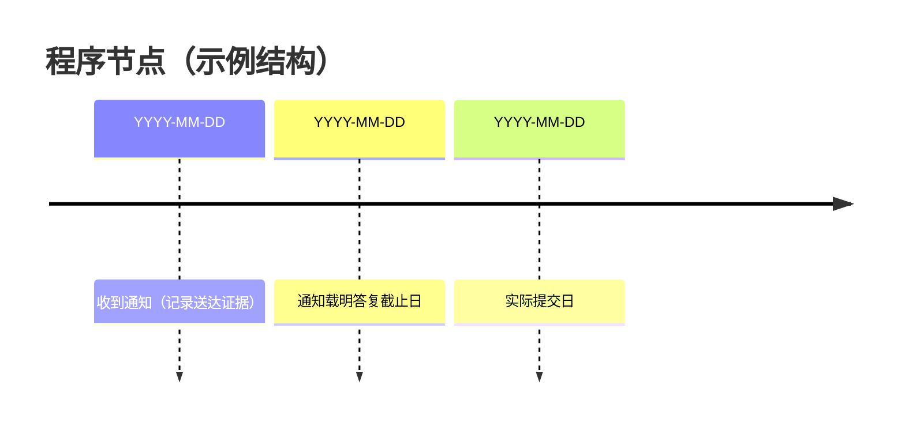

# 场景十：可视化输出

## 适用边界

将已经复核的权利要求、证据状态和条件性结论转化为图表。可视化不得提升证据等级、填补缺失事实或把初步分析渲染为法院结论。开始前读取 [共用法源与结论门禁](00-legal-basis.md)。

## 数据门禁

绘图前为每个节点保留以下字段：

- 专利号、权利要求号和完整引用链
- 产品/方法版本、法域和分析基准日
- 技术特征原文及位置
- 产品对应事实、证据来源和 `A/B/C/D` 状态
- 字面/等同分析类型及人工复核状态
- 法源基线ID、核验日期、最后有效权利要求版本，以及期限补偿或许可备案等状态节点

缺少权利要求号、产品版本、证据来源或状态时，不生成结论型图表，只生成“材料缺口图”。

## 一、权利要求引用关系图

用于展示多个独立权利要求和从属引用链，不用层数或节点数量表示稳定性。

图注应说明：每项从属权利要求包含其附加特征和完整引用链；是否被主张、是否稳定及产品是否落入须另行逐项判断。

## 二、特征—证据矩阵

| 权利要求/特征 | 产品对应 | 证据来源 | 状态 | 可否计入覆盖 | 下一动作 |
|---|---|---|---|---|---|
| 权利要求 1 / F1 | 可回查的实物结构 | 公证实物第 X 页 | `A-已证实` | 是 | 保留原始证据 |
| 权利要求 1 / F2 | 宣传图疑似具有该结构 | 网页截图第 Y 页 | `B-初步支持` | 否 | 拆解或取得图纸 |
| 权利要求 1 / F3 | 检测显示结构不同 | 检测报告第 Z 页 | `C-不相同/缺失` | 否 | 评估是否需要等同分析 |
| 权利要求 1 / F4 | 内部结构不可见 | 暂无 | `D-无法判断` | 否 | 取样、检测或证据保全 |

上述行仅是结构示例，不对应真实案件。

## 三、证据门禁流程图

图中不得把 `B`、`D` 显示为半个覆盖、虚线覆盖或“基本成立”；`C` 与 `B/D` 同时存在时，不得隐藏 `C` 对字面覆盖的否定作用。

## 四、多权利要求结论表

| 权利要求 | 字面比对门禁 | 等同分析 | 当前结论 | 主要缺口 |
|---|---|---|---|---|
|  | 通过/未通过 | 不需要/支持/不支持/无法判断 | 条件性表述 |  |

不同权利要求的结论不得合并为一个未经说明的“侵权/不侵权”标签。

## 五、时间线

程序时间线只显示已经核验的日期：

不得根据模板预填固定答复、起诉、上诉或审理周期。

## 六、交付检查

- [ ] 图表中的每个结论可回查到分析表和原始材料
- [ ] `B/D` 未计入覆盖，`C` 未被隐藏
- [ ] 多项独立和从属权利要求没有错接引用链
- [ ] 图例、法域、基准日、产品版本和证据状态完整
- [ ] Mermaid/SVG/图片已实际渲染，文字、箭头、换行和颜色可辨认
- [ ] 图表与正文结论一致，且保留“初步分析/人工复核”边界
- [ ] 时间线和状态图已按2026年指南影响核对最后有效权利要求、期限补偿和许可备案，旧基线未被直接复用

高保真图表可交给 `legal-visualization` 制作；最终报告可用 `md2word` 转换，但转换后仍须人工检查分页、表格和脚注。
